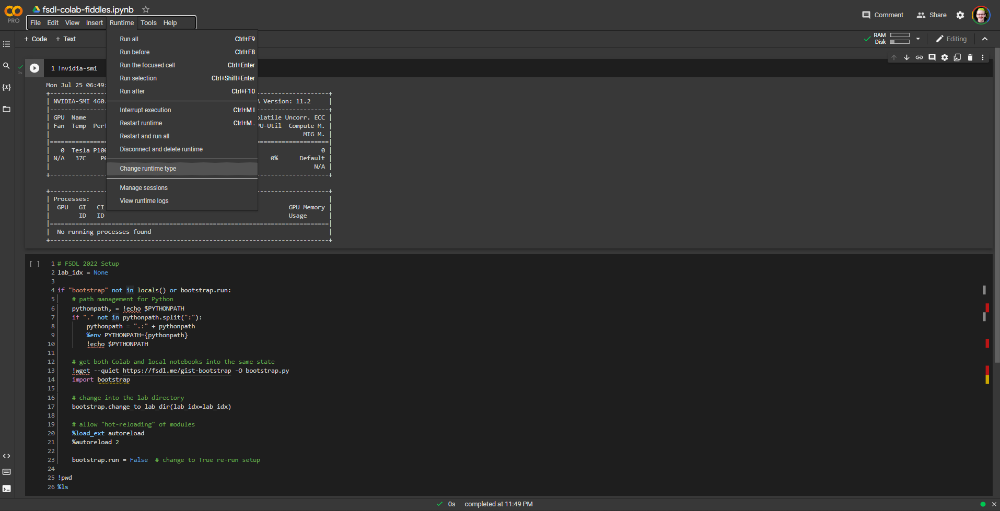

# Setup

Deep learning requires access to accelerated computation hardware.
Most commonly, those are NVIDIA GPUs or Google TPUs.

If you have access to a computer that has an NVIDIA GPU and runs Linux, you're welcome to [set it up](#Local) for local use.

If you don't, you can get free compute with [Google Colab](#Colab).

## Colab

Google Colab is a great way to get access to fast GPUs for free.
All you need is a Google account.

The preferred way to interact with the labs on Colab is just to click on badges like this one:
<div align="center">
  <a href="http://fsdl.me/lab01-colab">  </a>
</div> <br>

All setup is handled automatically,
so you can immediately start working on the labs.

But if you just want to use the codebase, then
go to [https://colab.research.google.com](https://colab.research.google.com)
and create a new notebook.

Connect your new notebook to a GPU runtime by doing Runtime > Change Runtime type > GPU.


Now, run `!nvidia-smi` in the first cell (press Shift+Enter to run a cell).
You should see a table showing your precious GPU :)

Now, paste the following into a cell and run it:

```
# FSDL 2022 Setup
lab_idx = None

if "bootstrap" not in locals() or bootstrap.run:
    # path management for Python
    pythonpath, = !echo $PYTHONPATH
    if "." not in pythonpath.split(":"):
        pythonpath = ".:" + pythonpath
        %env PYTHONPATH={pythonpath}
        !echo $PYTHONPATH

    # get both Colab and local notebooks into the same state
    !wget --quiet https://fsdl.me/gist-bootstrap -O bootstrap.py
    import bootstrap

    # change into the lab directory
    bootstrap.change_to_lab_dir(lab_idx=lab_idx)

    # allow "hot-reloading" of modules
    %load_ext autoreload
    %autoreload 2

    bootstrap.run = False  # change to True re-run setup

!pwd
%ls
```

The bootstrap script will
check out our lab repository,
`cd` into it,
and install required packages.
It also allows Python to find packages in the current working directory.

From there, you can `%cd` into a lab folder
to play around with the codebase for that lab,
either by directly writing Python,
e.g. `import text_recognizer`,
or by running shell commands, like
`!python training/run_experiment.py`.

### Colab Pro

You may be interested in signing up for [Colab Pro](https://colab.research.google.com/signup).

For $10/month, you get priority access to faster GPUs (e.g. [P100 vs K80](https://www.xcelerit.com/computing-benchmarks/insights/nvidia-p100-vs-k80-gpu/)) and TPUs, a 24h rather than 12h maximum runtime, and more RAM.

## Local

Setting up a machine that you can sit in front of or SSH into is easy.

### Summary

- `environment.yml` specifies Python and optionally CUDA/CUDNN
- `make conda-update` creates/updates a virtual environment
- `conda activate fsdl-text-recognizer-2022` activates the virtual environment
- `requirements/prod.in` and `requirements/dev.in` specify core Python packages in that environment
- `make pip-tools` resolves all other Python dependencies and installs them
- `export PYTHONPATH=.:$PYTHONPATH` makes the current directory visible on your Python path -- add it to your `~/.bashrc` and `source ~/.bashrc`

### 1. Check out the repo

```
git clone https://github.com/full-stack-deep-learning/fsdl-text-recognizer-2022-labs.git
cd fsdl-text-recognizer-2022-labs
```

### 2. Set up the Python environment

We use
[`conda`](https://docs.conda.io/en/latest/miniconda.html)
for managing Python and CUDA versions, and
[`pip-tools`](https://github.com/jazzband/pip-tools)
for managing Python package dependencies.

We add a `Makefile` for making setup dead-simple.

#### First: Install the Python + CUDA environment using Anaconda

Conda is an open-source package management system and environment management system that runs on Windows, macOS, and Linux.

It is most closely associated with Python, but
[in fact it can manage more than just Python environments](https://jakevdp.github.io/blog/2016/08/25/conda-myths-and-misconceptions/).

To install `conda`, follow instructions at https://conda.io/projects/conda/en/latest/user-guide/install/linux.html. We use Python 3.7.

Note that you will likely need to close and re-open your terminal.
Afterwards, you should have ability to run the `conda` command in your terminal.

Run `make conda-update` to create an environment called `fsdl-text-recognizer-2022`, as defined in `environment.yml`.
This environment will provide us with the right Python version as well as the CUDA and CUDNN libraries.

If you edit `environment.yml`, just run `make conda-update` again to get the latest changes.

Next, activate the conda environment.

```sh
conda activate fsdl-text-recognizer-2022
```

**IMPORTANT**: every time you work in this directory, make sure to start your session with `conda activate fsdl-text-recognizer-2022`.

#### Next: install Python packages

Next, install all necessary Python packages by running `make pip-tools`

Using `pip-tools` lets us do three nice things:

1. Separate out dev from production dependencies (`dev.in` vs `prod.in`).
2. Have a lockfile of exact versions for all dependencies (the auto-generated `dev.txt` and `prod.txt`).
3. Allow us to easily deploy to targets that don't support the `conda` environment, like Colab.

#### Set PYTHONPATH

Last, run `export PYTHONPATH=.` before executing any commands later on, or you will get errors like this:
```python
ModuleNotFoundError: No module named 'text_recognizer'
```

In order to not have to set `PYTHONPATH` in every terminal you open, just add that line as the last line of the `~/.bashrc` file using a text editor of your choice (e.g. `nano ~/.bashrc`) or by concatenating with `>>`
```bash
export PYTHONPATH=.:$PYTHONPATH" >> ~/.bashrc
```
